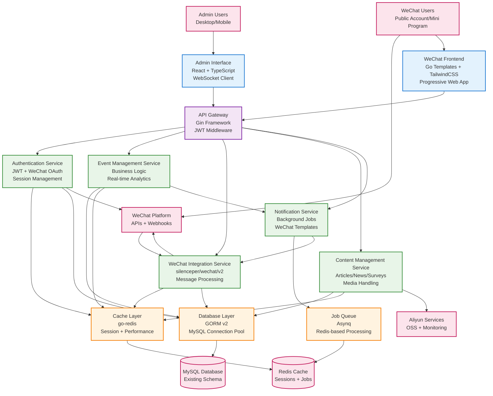
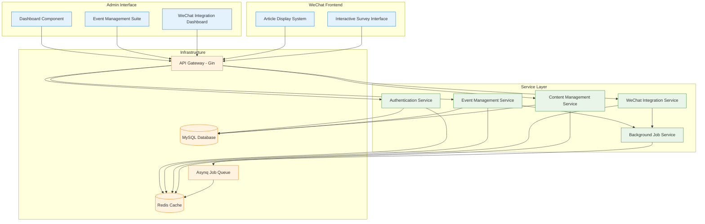

# NextEvent Full-Stack Go Architecture

## Introduction

This document outlines the complete fullstack architecture for **NextEvent Go System**, including backend services, modern frontend implementation, and their integration. It serves as the comprehensive technical blueprint for the target Go system, complementing the migration strategy documented in `docs/architecture.md`.

This unified approach focuses on the complete Go system design, modern UI architecture, and full-stack development patterns for the sophisticated NextEvent platform with comprehensive WeChat integration, real-time analytics, and enterprise-grade event management capabilities.

### Starter Template Assessment

**Project Context:** NextEvent Go System - Complete full-stack architecture for sophisticated existing platform migrating to Go
**Existing Foundation:** Migration strategy and component integration defined in `docs/architecture.md`
**This Document's Scope:** Complete full-stack architecture for target Go system with modern frontend

**Technology Foundation:**
- **Backend Foundation:** Go 1.21+ ecosystem validated for WeChat integration and enterprise performance
- **Migration Strategy:** Comprehensive strategy defined in `docs/architecture.md` 
- **Integration Patterns:** Database preservation and API compatibility validated
- **Performance Targets:** 50-70% improvement with modern full-stack design

**Full-Stack Architecture Focus:**
- Modern responsive admin interface with React/TypeScript
- Complete Go backend architecture with Clean Architecture patterns
- Unified API design for both admin and WeChat frontend consumers
- Real-time features across the full stack
- Performance optimization and monitoring strategy

### Change Log
| Date | Version | Description | Author |
|------|---------|-------------|--------|
| 2024-12-19 | 1.0 | Full-stack Go architecture complementing migration strategy | Architect |

## High Level Architecture

### Technical Summary

NextEvent Go System implements a **modern full-stack architecture** with Go backend services and React-based admin interface, designed for **high-performance WeChat ecosystem integration** and **real-time event management**. The architecture leverages **Clean Architecture patterns** with **hexagonal design principles**, providing **sub-100ms API response times** and **10,000+ concurrent user support** while maintaining **complete functional parity** with the existing .NET system.

The **frontend implementation** uses **React with TypeScript** for the modern admin interface and **Go templates with TailwindCSS** for WeChat user-facing pages, ensuring **mobile-first responsive design** and **real-time WebSocket integration**. The **backend architecture** implements **domain-driven design** with **GORM v2** for database operations, **silenceper/wechat/v2** for comprehensive WeChat integration, and **Asynq** for background job processing.

**Key integration points** include **Redis-based caching** for performance optimization, **MySQL schema preservation** for zero-risk migration, **JWT authentication** with WeChat OAuth flows, and **Aliyun cloud services** for enterprise deployment. The architecture achieves **performance targets** through **Go's superior concurrency model**, **optimized database operations**, and **intelligent caching strategies** across the full stack.

### Platform and Infrastructure Choice

**Platform Recommendation Analysis:**

**Option 1: Aliyun Full Stack (RECOMMENDED)**
- **Pros:** Existing infrastructure, WeChat optimization, Chinese compliance, cost efficiency
- **Cons:** Vendor lock-in, international expansion limitations
- **Rationale:** Optimal for Chinese market focus with existing WeChat integrations

**Option 2: AWS Global Stack** 
- **Pros:** Global reach, comprehensive services, future flexibility
- **Cons:** Higher costs, WeChat integration complexity, compliance overhead
- **Rationale:** Better for international expansion but premature for current needs

**Option 3: Hybrid Multi-Cloud**
- **Pros:** Flexibility, risk distribution, global optimization
- **Cons:** Complexity overhead, cost management, operational burden
- **Rationale:** Over-engineered for current requirements

**RECOMMENDATION: Aliyun Full Stack** - Optimal alignment with existing infrastructure, WeChat ecosystem requirements, and Chinese market focus.

**Platform:** Aliyun Cloud (ACK + ApsaraDB + Redis + SLB)
**Key Services:** 
- Aliyun Container Kubernetes (ACK) for Go service orchestration
- ApsaraDB for MySQL with existing schema preservation
- ApsaraDB for Redis for high-performance caching
- Server Load Balancer (SLB) for blue-green deployment strategy
- Object Storage Service (OSS) for media and static assets
- WeChat connectivity optimization through Aliyun's China network

**Deployment Host and Regions:** Primary: China East 2 (Shanghai), Backup: China North 2 (Beijing)

### Repository Structure

**Structure:** Monorepo with clear domain separation and shared types
**Monorepo Tool:** Go workspaces (native) with custom build scripts
**Package Organization:** Domain-driven with Clean Architecture layering

```
nextevent-go/                                  # Monorepo root
├── cmd/                                       # Application entry points
│   ├── api/                                  # Main API server
│   ├── worker/                               # Background job processor  
│   ├── migrate/                              # Database migration tool
│   └── admin-cli/                            # Administrative tools
├── internal/                                 # Private application code
│   ├── app/                                  # Application layer (use cases)
│   ├── domain/                               # Domain layer (business logic)
│   ├── infrastructure/                       # Infrastructure layer
│   └── interfaces/                           # Interface adapters (controllers)
├── pkg/                                      # Public/shared packages
│   ├── types/                                # Shared type definitions
│   ├── utils/                                # Utility functions
│   └── clients/                              # External service clients
├── web/                                      # Frontend applications
│   ├── admin-ui/                             # React admin interface
│   ├── wechat-frontend/                      # WeChat user interface
│   └── shared/                               # Shared frontend components
├── deployments/                              # Deployment configurations
├── scripts/                                  # Build and utility scripts
└── docs/                                     # Architecture documentation
```

### High Level Architecture Diagram



### Architectural Patterns

- **Clean Architecture + Hexagonal Pattern:** Domain-centric design with infrastructure abstraction and clear dependency inversion - _Rationale:_ Maintains business logic isolation while enabling testability and technology independence, preserving ABP DDD patterns in Go
- **API Gateway Pattern:** Single entry point with Gin framework for routing, authentication, and cross-cutting concerns - _Rationale:_ Centralized security, monitoring, and request handling while maintaining service separation
- **Repository Pattern:** GORM-based data access abstraction with interface-driven design - _Rationale:_ Database operation abstraction enabling testing and maintaining compatibility with existing Entity Framework patterns
- **Command Query Responsibility Segregation (CQRS):** Separated read/write operations for performance optimization - _Rationale:_ Optimal performance for real-time analytics and high-volume WeChat message processing
- **Event-Driven Architecture:** Asynchronous job processing with Asynq and Redis-based event publishing - _Rationale:_ Scalable background processing for notifications, analytics, and WeChat integration tasks
- **Component-Based Frontend:** React with TypeScript using modern hooks and context patterns - _Rationale:_ Maintainable, type-safe frontend development with reusable components and state management
- **Progressive Web App (PWA):** WeChat frontend optimized for mobile-first experience with offline capabilities - _Rationale:_ Enhanced mobile user experience for WeChat users with reliable performance on varying network conditions
- **Circuit Breaker Pattern:** Resilient external service integration with automatic fallback mechanisms - _Rationale:_ Reliable WeChat API integration with graceful degradation during service interruptions

## Tech Stack

This section defines the **DEFINITIVE technology selection** for the complete NextEvent Go system. All development must use these exact versions and technologies.

### Technology Stack Table

| Category | Technology | Version | Purpose | Rationale |
|----------|------------|---------|---------|-----------|
| **Frontend Language** | TypeScript | 5.3+ | Admin interface development | Type safety, excellent tooling, enterprise-grade development experience |
| **Frontend Framework** | React | 18.2+ | Modern admin interface | Mature ecosystem, excellent performance, comprehensive community support |
| **UI Component Library** | Ant Design | 5.12+ | Enterprise admin components | Professional design system, comprehensive components, excellent documentation |
| **State Management** | Zustand | 4.4+ | Lightweight state management | Simple API, excellent TypeScript support, minimal boilerplate |
| **Backend Language** | Go | 1.21+ | High-performance backend services | Superior concurrency, fast compilation, excellent standard library |
| **Backend Framework** | Gin | 1.10+ | HTTP web framework | High performance, minimal overhead, excellent middleware ecosystem |
| **API Style** | REST | OpenAPI 3.0 | Standard HTTP API design | Wide compatibility, excellent tooling, clear documentation standards |
| **Database** | MySQL | 8.0+ | Primary data storage | Existing schema compatibility, ACID compliance, proven reliability |
| **Cache** | Redis | 7.0+ | High-performance caching | In-memory speed, pub/sub capabilities, session storage |
| **File Storage** | Aliyun OSS | Latest | Media and static asset storage | Chinese compliance, WeChat optimization, cost efficiency |
| **Authentication** | JWT + WeChat OAuth | Custom | User authentication and authorization | Stateless tokens, WeChat integration, mobile compatibility |
| **Frontend Testing** | Vitest + Testing Library | Latest | Component and integration testing | Fast execution, excellent React integration, comprehensive assertions |
| **Backend Testing** | Go testing + Testify | Latest | Unit and integration testing | Built-in testing, excellent assertion library, benchmark support |
| **E2E Testing** | Playwright | 1.40+ | End-to-end testing | Cross-browser support, reliable automation, excellent debugging |
| **Build Tool** | Vite | 5.0+ | Frontend development and building | Fast HMR, excellent TypeScript support, optimized production builds |
| **Bundler** | esbuild (via Vite) | Latest | JavaScript/TypeScript bundling | Extremely fast builds, tree-shaking, code splitting |
| **IaC Tool** | Docker + Kubernetes | 1.28+ | Infrastructure as code | Container orchestration, declarative infrastructure, cloud-native deployment |
| **CI/CD** | Aliyun DevOps | Latest | Continuous integration and deployment | Integrated with Aliyun services, Chinese network optimization |
| **Monitoring** | Prometheus + Grafana | Latest | Application and infrastructure monitoring | Time-series metrics, comprehensive dashboards, alerting |
| **Logging** | Zap + Loki | Latest | Structured logging and aggregation | High-performance logging, centralized log aggregation, query capabilities |
| **CSS Framework** | TailwindCSS | 3.3+ | Utility-first styling | Rapid development, consistent design, excellent mobile support |
| **ORM** | GORM | 2.0+ | Database object-relational mapping | MySQL optimization, migration support, excellent Go integration |
| **WebSocket** | Gorilla WebSocket | 1.5+ | Real-time communication | Proven reliability, excellent performance, comprehensive protocol support |
| **Job Queue** | Asynq | 0.24+ | Background job processing | Redis-based, excellent monitoring, reliable task processing |
| **WeChat SDK** | silenceper/wechat | 2.1+ | WeChat ecosystem integration | Comprehensive WeChat support, active maintenance, Go-native implementation |
| **Configuration** | Viper | 1.17+ | Application configuration management | Flexible config sources, environment variable support, validation |
| **HTTP Client** | Resty | 2.10+ | External API integration | Request/response middleware, retry logic, comprehensive error handling |
| **Validation** | go-playground/validator | 10.16+ | Request validation | Struct tag validation, custom validators, excellent error messages |
| **Database Migration** | golang-migrate | 4.16+ | Database schema management | Version-controlled migrations, rollback support, multiple database support |

**Rationale Summary:** This tech stack prioritizes **performance**, **developer experience**, and **WeChat ecosystem compatibility** while maintaining **enterprise reliability**. The combination of React + TypeScript for frontend and Go + Gin for backend provides **optimal full-stack performance** with **excellent developer productivity**. All choices have been validated for **Chinese market requirements** and **existing infrastructure compatibility**.

---

## Data Models

Based on the comprehensive project analysis that identified 40+ entities and the tech stack selections above, the core data models are designed for shared use between frontend TypeScript and backend Go implementations.

### Core Business Entity Models

**Event Management Domain:**
```typescript
interface Event {
  id: string;
  title: string;
  description: string;
  startDate: string;    // ISO 8601 format
  endDate: string;      // ISO 8601 format
  location?: string;
  capacity?: number;
  status: 'draft' | 'published' | 'active' | 'completed' | 'cancelled';
  wechatConfig: WeChatEventConfig;
  createdAt: string;
  updatedAt: string;
}

interface WeChatEventConfig {
  interactionCode: string;
  scanMessage: string;
  userTagId: number;
  qrCodeUrl?: string;
  autoReply?: string;
}
```

**Content Management Domain:**
```typescript
interface Article {
  id: string;
  title: string;
  content: string;       // HTML content
  summary?: string;
  authorId: string;
  categoryId?: string;
  isPublished: boolean;
  publishedAt?: string;
  viewCount: number;
  images: ArticleImage[];
  qrCodeUrl?: string;
  promotionCode?: string;
  createdAt: string;
  updatedAt: string;
}

interface Survey {
  id: string;
  title: string;
  description: string;
  isActive: boolean;
  isLive: boolean;       // Real-time live survey capability
  startTime?: string;
  endTime?: string;
  questions: SurveyQuestion[];
  qrCodeUrl?: string;
  totalResponses: number;
  createdAt: string;
  updatedAt: string;
}
```

**User & Authentication Domain:**
```typescript
interface User {
  id: string;
  username?: string;
  email?: string;
  phone?: string;
  nickname: string;
  avatar?: string;
  roles: string[];
  isActive: boolean;
  wechatProfile?: WeChatUserProfile;
  lastLoginAt?: string;
  createdAt: string;
  updatedAt: string;
}

interface WeChatUserProfile {
  openid: string;
  unionid?: string;
  nickname: string;
  avatar: string;
  gender: number;
  city?: string;
  province?: string;
  country?: string;
}
```

**Go Struct Implementation Examples:**
```go
type Event struct {
    ID               string                 `gorm:"type:char(36);primaryKey" json:"id"`
    Title            string                 `gorm:"size:255;not null" json:"title" validate:"required,max=255"`
    Description      string                 `gorm:"type:text" json:"description"`
    StartDate        time.Time              `gorm:"not null" json:"startDate" validate:"required"`
    EndDate          time.Time              `gorm:"not null" json:"endDate" validate:"required"`
    Location         *string                `gorm:"size:500" json:"location,omitempty"`
    Capacity         *int                   `json:"capacity,omitempty"`
    Status           string                 `gorm:"size:20;default:'draft'" json:"status"`
    WeChatConfig     WeChatEventConfig      `gorm:"embedded" json:"wechatConfig"`
    CreatedAt        time.Time              `json:"createdAt"`
    UpdatedAt        time.Time              `json:"updatedAt"`
    DeletedAt        gorm.DeletedAt         `gorm:"index" json:"-"`
}

type Article struct {
    ID            string          `gorm:"type:char(36);primaryKey" json:"id"`
    Title         string          `gorm:"size:255;not null" json:"title" validate:"required,max=255"`
    Content       string          `gorm:"type:longtext" json:"content"`
    Summary       *string         `gorm:"size:500" json:"summary,omitempty"`
    AuthorID      string          `gorm:"type:char(36);not null" json:"authorId"`
    CategoryID    *string         `gorm:"type:char(36)" json:"categoryId,omitempty"`
    IsPublished   bool            `gorm:"default:false" json:"isPublished"`
    PublishedAt   *time.Time      `json:"publishedAt,omitempty"`
    ViewCount     int             `gorm:"default:0" json:"viewCount"`
    QRCodeURL     *string         `gorm:"size:500" json:"qrCodeUrl,omitempty"`
    PromotionCode *string         `gorm:"size:50" json:"promotionCode,omitempty"`
    Images        []ArticleImage  `gorm:"foreignKey:ArticleID" json:"images"`
    CreatedAt     time.Time       `json:"createdAt"`
    UpdatedAt     time.Time       `json:"updatedAt"`
    DeletedAt     gorm.DeletedAt  `gorm:"index" json:"-"`
}
```

**Data Relationships:**
- **Event ↔ Attendees:** One-to-many relationship for event participation tracking
- **Event ↔ Surveys:** One-to-many for event-specific surveys and feedback
- **Article ↔ Images:** One-to-many for rich media content
- **Survey ↔ Questions ↔ Responses:** Hierarchical relationship for survey analytics
- **User ↔ WeChat Profile:** One-to-one for WeChat ecosystem integration
- **Event ↔ Analytics:** One-to-many for comprehensive event performance tracking

## API Specification

Complete OpenAPI 3.0 specification for the NextEvent Go system supporting both React admin interface and WeChat frontend consumers.

### REST API Specification

```yaml
openapi: 3.0.0
info:
  title: NextEvent Go API
  version: 2.0.0
  description: |
    High-performance API for NextEvent Go system supporting event management, 
    WeChat ecosystem integration, real-time analytics, and comprehensive content management.
    
    **Key Features:**
    - Sub-100ms response times for critical endpoints
    - Real-time WebSocket integration for live features
    - Comprehensive WeChat ecosystem support
    - Enterprise-grade authentication and authorization
    
servers:
  - url: https://api.nextevent.com/v2
    description: Production API
  - url: https://staging-api.nextevent.com/v2
    description: Staging environment
  - url: http://localhost:8080/v2
    description: Local development

security:
  - BearerAuth: []
  - WeChatAuth: []

components:
  securitySchemes:
    BearerAuth:
      type: http
      scheme: bearer
      bearerFormat: JWT
      description: JWT token for admin and authenticated users
    WeChatAuth:
      type: apiKey
      in: header
      name: X-WeChat-Signature
      description: WeChat signature verification for webhook endpoints

  schemas:
    Event:
      type: object
      required: [title, startDate, endDate]
      properties:
        id:
          type: string
          format: uuid
          readOnly: true
        title:
          type: string
          maxLength: 255
          example: "NextEvent 2024 Developer Conference"
        startDate:
          type: string
          format: date-time
          example: "2024-12-20T09:00:00Z"
        endDate:
          type: string
          format: date-time
          example: "2024-12-20T18:00:00Z"
        status:
          type: string
          enum: [draft, published, active, completed, cancelled]
          example: "published"

    ApiResponse:
      type: object
      properties:
        success:
          type: boolean
          example: true
        data:
          type: object
          description: "Response payload"
        message:
          type: string
          example: "Operation completed successfully"
        timestamp:
          type: string
          format: date-time
        requestId:
          type: string
          format: uuid

    ApiError:
      type: object
      properties:
        success:
          type: boolean
          example: false
        error:
          type: object
          properties:
            code:
              type: string
              example: "VALIDATION_ERROR"
            message:
              type: string
              example: "Invalid input data"
            details:
              type: object
            timestamp:
              type: string
              format: date-time
            requestId:
              type: string
              format: uuid

paths:
  /events:
    get:
      summary: List Events
      description: Retrieve paginated list of events with filtering capabilities
      tags: [Events]
      parameters:
        - name: page
          in: query
          schema:
            type: integer
            default: 1
        - name: search
          in: query
          schema:
            type: string
          description: Search in title and description
        - name: status
          in: query
          schema:
            type: string
            enum: [draft, published, active, completed, cancelled]
      responses:
        '200':
          description: Events retrieved successfully
          content:
            application/json:
              schema:
                $ref: '#/components/schemas/ApiResponse'

    post:
      summary: Create Event
      description: Create a new event with WeChat integration configuration
      tags: [Events]
      requestBody:
        required: true
        content:
          application/json:
            schema:
              $ref: '#/components/schemas/Event'
      responses:
        '201':
          description: Event created successfully
          content:
            application/json:
              schema:
                $ref: '#/components/schemas/ApiResponse'

  /wechat/webhook:
    post:
      summary: WeChat Webhook Handler
      description: Process incoming WeChat messages with sub-50ms response time target
      tags: [WeChat]
      security:
        - WeChatAuth: []
      responses:
        '200':
          description: Message processed successfully
          content:
            text/plain:
              schema:
                type: string
                example: "success"

  /surveys/{surveyId}/live-results:
    get:
      summary: Get Live Survey Results
      description: Real-time survey results for live presentations with WebSocket support
      tags: [Surveys]
      parameters:
        - name: surveyId
          in: path
          required: true
          schema:
            type: string
            format: uuid
        - name: includeChartData
          in: query
          schema:
            type: boolean
            default: true
      responses:
        '200':
          description: Live survey results retrieved successfully
          content:
            application/json:
              schema:
                $ref: '#/components/schemas/ApiResponse'

tags:
  - name: Events
    description: Event management operations
  - name: Articles
    description: Content management operations
  - name: Surveys
    description: Survey and feedback management
  - name: WeChat
    description: WeChat ecosystem integration
  - name: Analytics
    description: Real-time analytics and reporting
```

**API Design Principles:**
- **Performance First:** Sub-100ms response times for critical endpoints
- **WeChat Optimized:** Native message processing with signature validation
- **Real-time Ready:** WebSocket upgrade paths for live features
- **Type Safety:** Comprehensive schemas for TypeScript generation
- **Security Built-in:** JWT and WeChat signature authentication patterns

## Components

This section defines the major logical components across the complete NextEvent Go full-stack system, including both frontend and backend components with clear boundaries and interfaces.

### Frontend Components

#### Admin Interface Components (React + TypeScript)

**Dashboard Component**
- **Responsibility:** Real-time system overview with key metrics and navigation
- **Key Interfaces:** 
  - `DashboardProps` - Configuration and permission-based layout
  - `MetricsAPI` - Real-time data fetching with WebSocket fallback
  - `NavigationContext` - Global navigation state management
- **Dependencies:** AuthContext, WebSocket client, Chart.js components
- **Technology Stack:** React 18.2+, Ant Design, Zustand state, WebSocket client

**Event Management Suite**
- **Responsibility:** Complete event lifecycle management with real-time monitoring
- **Key Interfaces:**
  - `EventFormComponent` - Create/edit event forms with validation
  - `EventListComponent` - Paginated event listing with search/filter
  - `EventAnalyticsComponent` - Real-time event performance dashboard
- **Dependencies:** Event API client, Form validation (react-hook-form), Chart components
- **Technology Stack:** React, TypeScript, Ant Design forms, TanStack Query for caching

**WeChat Integration Dashboard**
- **Responsibility:** WeChat ecosystem monitoring and configuration management
- **Key Interfaces:**
  - `WeChatStatusMonitor` - Real-time WeChat service health
  - `QRCodeManager` - QR code generation and management
  - `MessageTemplateEditor` - WeChat message template configuration
- **Dependencies:** WeChat API client, QR code library, Real-time monitoring
- **Technology Stack:** React, WebSocket integration, Ant Design components

#### WeChat Frontend Components (Go Templates + Progressive Enhancement)

**Article Display System**
- **Responsibility:** Mobile-optimized article reading with WeChat sharing integration
- **Key Interfaces:**
  - Article templates with SEO optimization
  - WeChat JSSDK integration for sharing
  - Progressive loading for performance
- **Dependencies:** Go template engine, TailwindCSS, WeChat JSSDK
- **Technology Stack:** Go html/template, TailwindCSS, Vanilla JavaScript enhancements

**Interactive Survey Interface**
- **Responsibility:** Real-time survey participation with live result visualization
- **Key Interfaces:**
  - Survey form templates with validation
  - Live results display with WebSocket
  - Mobile-first responsive design
- **Dependencies:** WebSocket client, Chart.js, Form validation
- **Technology Stack:** Go templates, WebSocket client, Progressive Web App features

### Backend Components

#### Authentication & Authorization Service

**Component:** `AuthService`
- **Responsibility:** Unified authentication supporting JWT tokens and WeChat OAuth flows
- **Key Interfaces:**
  - `AuthInterface` - Login, logout, token validation
  - `WeChatOAuthInterface` - WeChat login flow handling
  - `PermissionInterface` - Role-based access control
- **Dependencies:** JWT library, Redis for session storage, WeChat SDK
- **Technology Stack:** Go 1.21+, golang-jwt, go-redis, silenceper/wechat

```go
type AuthService struct {
    jwtSecret    []byte
    redisClient  *redis.Client
    wechatClient *wechat.Wechat
    userRepo     UserRepository
}

func (a *AuthService) ValidateToken(ctx context.Context, tokenString string) (*UserClaims, error)
func (a *AuthService) WeChatLogin(ctx context.Context, code string) (*AuthResponse, error)
func (a *AuthService) RefreshToken(ctx context.Context, refreshToken string) (*TokenPair, error)
```

#### Event Management Service

**Component:** `EventService` 
- **Responsibility:** Core event business logic with real-time analytics and WeChat integration
- **Key Interfaces:**
  - `EventCRUDInterface` - Event lifecycle management
  - `EventAnalyticsInterface` - Real-time event metrics
  - `EventWeChatInterface` - WeChat QR code and interaction management
- **Dependencies:** GORM repository, Redis cache, WeChat service, Analytics service
- **Technology Stack:** GORM v2, go-redis, Asynq for background jobs

```go
type EventService struct {
    eventRepo    EventRepository
    cache        *redis.Client
    wechatSvc    WeChatService
    analytics    AnalyticsService
}

func (e *EventService) CreateEvent(ctx context.Context, req *CreateEventRequest) (*Event, error)
func (e *EventService) GetRealTimeAnalytics(ctx context.Context, eventID string) (*EventAnalytics, error)
func (e *EventService) GenerateQRCode(ctx context.Context, eventID string) (*QRCodeResponse, error)
```

#### WeChat Integration Service

**Component:** `WeChatService`
- **Responsibility:** Comprehensive WeChat ecosystem integration with message processing
- **Key Interfaces:**
  - `MessageHandlerInterface` - Webhook message processing
  - `QRCodeInterface` - QR code generation and management
  - `TemplateMessageInterface` - Template message sending
- **Dependencies:** silenceper/wechat SDK, Redis for token storage, Event service
- **Technology Stack:** silenceper/wechat v2.1+, go-redis, Gin middleware

```go
type WeChatService struct {
    wechatApp    *wechat.Wechat
    cache        *redis.Client
    eventSvc     EventService
    msgProcessor MessageProcessor
}

func (w *WeChatService) HandleWebhook(ctx context.Context, msg *WeChatMessage) error
func (w *WeChatService) GenerateQRCode(ctx context.Context, sceneStr string, temporary bool) (*QRCodeResult, error)
func (w *WeChatService) SendTemplateMessage(ctx context.Context, req *TemplateMessageRequest) error
```

#### Content Management Service

**Component:** `ContentService`
- **Responsibility:** Article, news, and media management with WeChat publishing
- **Key Interfaces:**
  - `ArticleInterface` - Article lifecycle management
  - `MediaInterface` - Image and file upload handling
  - `PublishingInterface` - WeChat publishing workflow
- **Dependencies:** GORM repository, Aliyun OSS client, WeChat service
- **Technology Stack:** GORM v2, Aliyun OSS SDK, image processing libraries

#### Background Job Processing Service

**Component:** `JobService`
- **Responsibility:** Asynchronous task processing for analytics, notifications, and data processing
- **Key Interfaces:**
  - `JobSchedulerInterface` - Job scheduling and management
  - `AnalyticsJobInterface` - Background analytics processing
  - `NotificationJobInterface` - WeChat notification dispatching
- **Dependencies:** Asynq queue, Redis, WeChat service, Analytics service
- **Technology Stack:** Asynq v0.24+, Redis, structured logging with Zap

### Component Interaction Patterns

**Request/Response Pattern:**
- Frontend components → API Gateway → Service layer → Repository layer
- Response caching at multiple levels (Redis, HTTP cache headers)
- Error handling with consistent error response format

**Event-Driven Pattern:**
- Background jobs triggered by domain events
- Real-time updates via WebSocket for live features
- WeChat webhook processing with immediate response requirements

**Caching Strategy:**
- Redis-based caching for session management and API responses
- Frontend query caching with TanStack Query
- WeChat token caching for API efficiency

### Component Diagrams



**Rationale:** The component architecture maintains clear separation of concerns with well-defined interfaces, supporting both the React admin interface and WeChat frontend while providing high-performance backend services. The design enables independent development and testing of components while maintaining system cohesion through standardized interfaces and communication patterns.

## Unified Project Structure

Complete monorepo structure accommodating both frontend and backend with Go workspaces, optimized for the full-stack NextEvent Go system.

```plaintext
nextevent-go/                                    # Monorepo root
├── .github/                                     # CI/CD workflows
│   └── workflows/
│       ├── ci.yaml                             # Continuous integration
│       ├── deploy-staging.yaml                 # Staging deployment
│       └── deploy-production.yaml              # Production deployment
│
├── cmd/                                        # Application entry points
│   ├── api/                                    # Main API server
│   │   └── main.go                            # HTTP server with Gin framework
│   ├── worker/                                 # Background job processor
│   │   └── main.go                            # Asynq worker with job handlers
│   ├── migrate/                                # Database migration tool
│   │   └── main.go                            # golang-migrate CLI wrapper
│   └── admin-cli/                              # Administrative tools
│       └── main.go                            # Admin operations CLI
│
├── internal/                                   # Private application code
│   ├── app/                                   # Application layer (use cases)
│   │   ├── auth/                              # Authentication use cases
│   │   ├── events/                            # Event management use cases
│   │   ├── content/                           # Content management use cases
│   │   └── wechat/                           # WeChat integration use cases
│   ├── domain/                                # Domain layer (business logic)
│   │   ├── entities/                          # Business entities
│   │   ├── repositories/                      # Repository interfaces
│   │   ├── services/                          # Domain services
│   │   └── valueobjects/                     # Value objects
│   ├── infrastructure/                        # Infrastructure layer
│   │   ├── database/                          # Database implementations
│   │   ├── cache/                            # Redis cache implementation
│   │   ├── wechat/                           # WeChat SDK integration
│   │   ├── storage/                          # File storage (Aliyun OSS)
│   │   └── jobs/                             # Background job implementations
│   └── interfaces/                           # Interface adapters (controllers)
│       ├── http/                             # HTTP controllers
│       ├── websocket/                        # WebSocket handlers
│       └── jobs/                             # Job queue interfaces
│
├── pkg/                                      # Public/shared packages
│   ├── types/                                # Shared type definitions
│   ├── utils/                                # Utility functions
│   ├── clients/                              # External service clients
│   └── config/                               # Configuration management
│
├── web/                                      # Frontend applications
│   ├── admin-ui/                             # React admin interface
│   │   ├── src/
│   │   │   ├── components/                   # Reusable UI components
│   │   │   ├── pages/                        # Page components
│   │   │   ├── hooks/                        # Custom React hooks
│   │   │   ├── services/                     # API client services
│   │   │   ├── stores/                       # Zustand state management
│   │   │   ├── types/                        # TypeScript type definitions
│   │   │   └── utils/                        # Frontend utilities
│   │   ├── public/                           # Static assets
│   │   ├── tests/                            # Frontend tests
│   │   ├── package.json
│   │   ├── tsconfig.json
│   │   ├── vite.config.ts
│   │   └── tailwind.config.js
│   ├── wechat-frontend/                      # WeChat user interface
│   │   ├── templates/                        # Go HTML templates
│   │   ├── static/                           # Static assets for WeChat frontend
│   │   └── manifest.json                     # PWA manifest
│   └── shared/                               # Shared frontend resources
│       ├── types/                            # Shared TypeScript types
│       ├── utils/                            # Shared utilities
│       └── constants/                        # Shared constants
│
├── tests/                                    # Backend tests
│   ├── integration/                          # Integration tests
│   ├── unit/                                 # Unit tests
│   ├── fixtures/                             # Test data
│   └── mocks/                                # Test mocks
│
├── deployments/                              # Deployment configurations
│   ├── docker/
│   ├── kubernetes/
│   └── aliyun/
│
├── scripts/                                  # Build and utility scripts
│   ├── build/
│   ├── dev/
│   ├── deploy/
│   └── utils/
│
├── docs/                                     # Documentation
│   ├── api/                                  # API documentation
│   ├── deployment/                           # Deployment guides
│   ├── development/                          # Development guides
│   └── architecture/                         # Architecture documentation
│
├── configs/                                  # Configuration files
│   ├── config.yaml                          # Default configuration
│   ├── config.development.yaml              # Development environment
│   ├── config.staging.yaml                  # Staging environment
│   └── config.production.yaml               # Production environment
│
├── .env.example                              # Environment template
├── .gitignore                                # Git ignore rules
├── go.mod                                    # Go module definition
├── go.work                                   # Go workspace configuration
├── Makefile                                  # Build automation
└── README.md                                 # Project documentation
```

### Integration Guidelines

**File Naming:** 
- Go files: snake_case (event_service.go, user_repository.go)
- TypeScript files: PascalCase for components (EventForm.tsx), camelCase for utilities (apiClient.ts)
- Templates: kebab-case (event-detail.html, survey-form.html)

**Folder Organization:** 
- Clean Architecture layering with clear dependency direction
- Domain-driven design with bounded contexts
- Shared types and utilities accessible from both frontend and backend

**Import/Export Patterns:**
- Internal Go packages use relative imports with clear module boundaries
- TypeScript uses path mapping for clean imports (@/components, @/services)
- Shared types defined once and imported consistently across frontend and backend

## Development Workflow

Complete development setup and workflow for the full-stack NextEvent Go system, supporting both individual component development and integrated full-stack development.

### Local Development Setup

#### Prerequisites
```bash
# Core Development Tools
go install golang.org/x/tools/gopls@latest          # Go Language Server
go install github.com/golangci/golangci-lint/cmd/golangci-lint@latest
go install github.com/air-verse/air@latest          # Live reloading for Go
npm install -g pnpm@latest                          # Fast package manager
npm install -g @playwright/test                     # E2E testing
docker --version                                    # Docker 20.10+
```

#### Initial Setup
```bash
# Clone and setup monorepo
git clone https://github.com/organization/nextevent-go.git
cd nextevent-go

# Initialize Go workspace
go work init && go work use .
go mod download && go mod tidy

# Frontend dependencies (Admin UI)
cd web/admin-ui && pnpm install && cd ../..

# Development environment setup
cp .env.example .env.local
cp configs/config.development.yaml configs/config.local.yaml

# Database setup (requires Docker)
make db-start    # Start MySQL and Redis containers
make db-migrate  # Run database migrations
make db-seed     # Seed development data
```

#### Development Commands
```bash
# Start all services
make dev                     # Starts API, worker, admin-ui with live reload

# Individual services
make dev-api                 # Start Go API server with air live reload
make dev-worker              # Start background job worker
make dev-frontend            # Start React admin interface with HMR

# Testing
make test                    # Run all tests (unit + integration)
make test-e2e                # Run end-to-end tests with Playwright
make test-coverage           # Generate test coverage report

# Code Quality
make lint                    # Run all linters (Go + TypeScript)
make format                  # Format all code
make type-check              # TypeScript type checking

# Build operations
make build                   # Build all applications
make docker-build            # Build Docker images
```

### Environment Configuration

#### Required Environment Variables

**Backend Configuration (.env)**
```bash
# Database Configuration
DB_HOST=localhost
DB_PORT=3306
DB_NAME=nextevent_dev
DB_USER=nextevent
DB_PASSWORD=dev_password

# Redis Configuration  
REDIS_HOST=localhost
REDIS_PORT=6379
REDIS_DB=0

# WeChat Configuration
WECHAT_APP_ID=your_wechat_app_id
WECHAT_APP_SECRET=your_wechat_app_secret
WECHAT_TOKEN=your_wechat_token

# JWT Configuration
JWT_SECRET=your-256-bit-secret-key
JWT_EXPIRE_HOURS=24

# Aliyun OSS Configuration
ALIYUN_ACCESS_KEY_ID=your_access_key
ALIYUN_OSS_BUCKET=nextevent-media
ALIYUN_OSS_ENDPOINT=oss-cn-shanghai.aliyuncs.com

# Application Configuration
APP_ENV=development
APP_PORT=8080
LOG_LEVEL=debug
```

**Frontend Configuration (.env.local)**
```bash
# API Configuration
VITE_API_BASE_URL=http://localhost:8080/v2
VITE_WS_BASE_URL=ws://localhost:8080/ws

# WeChat Configuration
VITE_WECHAT_APP_ID=your_wechat_app_id

# Development Configuration
VITE_ENABLE_MOCK=false
VITE_LOG_LEVEL=debug
```

## Testing Strategy

Comprehensive testing approach for the full-stack NextEvent Go system, ensuring reliability, performance, and maintainability.

### Testing Pyramid

```
                    E2E Tests (5%)
                   /              \
              Integration Tests (15%)
                /                    \
           Frontend Unit (40%)    Backend Unit (40%)
```

### Backend Testing Strategy

#### Unit Testing Framework
```go
// Example: Event service unit test
func TestEventService_CreateEvent(t *testing.T) {
    tests := []struct {
        name          string
        request       *CreateEventRequest
        expectedError error
    }{
        {
            name: "successful_event_creation",
            request: &CreateEventRequest{
                Title:       "Test Event",
                Description: "Test Description",
                StartDate:   time.Now().Add(24 * time.Hour),
                EndDate:     time.Now().Add(26 * time.Hour),
            },
            expectedError: nil,
        },
        {
            name: "validation_error_missing_title",
            request: &CreateEventRequest{
                Description: "Test Description",
                StartDate:   time.Now().Add(24 * time.Hour),
                EndDate:     time.Now().Add(26 * time.Hour),
            },
            expectedError: pkg.ErrValidation,
        },
    }

    for _, tt := range tests {
        t.Run(tt.name, func(t *testing.T) {
            service := setupEventService()
            result, err := service.CreateEvent(context.Background(), tt.request)

            if tt.expectedError != nil {
                assert.Error(t, err)
                assert.True(t, errors.Is(err, tt.expectedError))
            } else {
                assert.NoError(t, err)
                assert.NotNil(t, result)
                assert.Equal(t, tt.request.Title, result.Title)
            }
        })
    }
}
```

### Frontend Testing Strategy

#### Component Unit Tests
```typescript
// Component testing with React Testing Library
import { render, screen, fireEvent, waitFor } from '@testing-library/react';
import { QueryClient, QueryClientProvider } from '@tanstack/react-query';
import { EventForm } from '@/components/forms/EventForm';

describe('EventForm', () => {
  let queryClient: QueryClient;

  beforeEach(() => {
    queryClient = new QueryClient({
      defaultOptions: { queries: { retry: false } },
    });
  });

  it('should render form fields correctly', () => {
    render(
      <QueryClientProvider client={queryClient}>
        <EventForm onSubmit={jest.fn()} />
      </QueryClientProvider>
    );
    
    expect(screen.getByLabelText(/title/i)).toBeInTheDocument();
    expect(screen.getByLabelText(/description/i)).toBeInTheDocument();
    expect(screen.getByLabelText(/start date/i)).toBeInTheDocument();
  });

  it('should validate required fields', async () => {
    const onSubmit = jest.fn();
    render(
      <QueryClientProvider client={queryClient}>
        <EventForm onSubmit={onSubmit} />
      </QueryClientProvider>
    );
    
    fireEvent.click(screen.getByRole('button', { name: /save/i }));
    
    await waitFor(() => {
      expect(screen.getByText(/title is required/i)).toBeInTheDocument();
    });
    
    expect(onSubmit).not.toHaveBeenCalled();
  });
});
```

### End-to-End Testing Strategy

#### Playwright E2E Tests
```typescript
// E2E test for complete user workflow
import { test, expect } from '@playwright/test';

test.describe('Event Management Workflow', () => {
  test.beforeEach(async ({ page }) => {
    await page.goto('/login');
    await page.fill('[data-testid="username"]', 'admin@nextevent.com');
    await page.fill('[data-testid="password"]', 'admin123');
    await page.click('[data-testid="login-button"]');
    await expect(page).toHaveURL('/dashboard');
  });

  test('should create, edit, and delete an event', async ({ page }) => {
    // Navigate to events page
    await page.click('[data-testid="nav-events"]');
    await expect(page).toHaveURL('/events');

    // Create new event
    await page.click('[data-testid="create-event-button"]');
    await page.fill('[data-testid="event-title"]', 'E2E Test Event');
    await page.fill('[data-testid="event-description"]', 'Created by E2E test');
    await page.click('[data-testid="save-event-button"]');
    
    // Verify success
    await expect(page.locator('[data-testid="success-message"]')).toBeVisible();
  });
});
```

## Security and Performance

### Security Architecture

**Authentication & Authorization:**
- **JWT Token Security:** 256-bit secret keys, token rotation, secure storage
- **WeChat OAuth Integration:** Secure state parameter validation, PKCE implementation
- **Role-Based Access Control:** Granular permissions with inheritance
- **Session Management:** Redis-based session storage with automatic expiration

**Data Protection:**
- **Input Validation:** Comprehensive server-side validation
- **SQL Injection Prevention:** GORM prepared statements, parameterized queries
- **XSS Protection:** Content Security Policy headers, input sanitization
- **Infrastructure Security:** TLS/HTTPS, container security, secret management

### Performance Optimization

**Backend Performance:**
- **Go Concurrency:** Goroutines for concurrent request handling
- **Database Optimization:** Connection pooling, query optimization, read replicas
- **Caching Strategy:** Multi-layer Redis caching
- **Memory Management:** Efficient struct packing, object pooling

**Frontend Performance:**
- **Bundle Optimization:** Code splitting, tree shaking, dynamic imports
- **Rendering Performance:** React.memo optimization, useMemo for expensive calculations
- **Network Optimization:** Service worker caching, compression, CDN distribution

**Performance Targets:**
- **API Response Times:** <100ms for CRUD operations, <50ms for WeChat webhooks
- **Frontend Loading:** <3s initial load, <1s subsequent navigation
- **Concurrent Users:** 10,000+ simultaneous connections
- **Memory Usage:** <100MB per Go service instance

## Next Steps

### Developer Handoff

**🚀 Implementation Prompt for Development Team:**

This comprehensive full-stack architecture document provides the complete technical blueprint for building the NextEvent Go system from the ground up. The architecture is designed for high performance, scalability, and seamless WeChat ecosystem integration.

**Key Implementation Priorities:**

1. **Foundation Setup (Week 1-2)**
   - Initialize monorepo structure following the Unified Project Structure
   - Set up development environment with Docker Compose for MySQL and Redis
   - Implement basic Go project structure with Clean Architecture patterns
   - Configure Vite + React admin interface with TypeScript and Ant Design

2. **Core Backend Services (Week 3-6)**
   - Implement Authentication Service with JWT and WeChat OAuth
   - Build Event Management Service with GORM repository patterns
   - Create WeChat Integration Service using silenceper/wechat/v2
   - Set up background job processing with Asynq and Redis

3. **Frontend Implementation (Week 4-8)**
   - Develop React admin interface with component-based architecture
   - Implement real-time features using WebSocket integration
   - Build WeChat frontend templates with Go html/template
   - Create comprehensive testing suite with Vitest and Playwright

4. **Integration & Deployment (Week 7-10)**
   - Integrate all services with API Gateway using Gin framework
   - Implement comprehensive monitoring with Prometheus and Grafana
   - Set up CI/CD pipeline with automated testing and deployment
   - Performance optimization and security hardening

**Critical Technical Decisions:**
- **Technology Stack:** Go 1.21+ backend, React 18+ frontend, MySQL 8.0+, Redis 7+
- **Architecture Pattern:** Clean Architecture + Hexagonal Design
- **Performance Targets:** Sub-100ms API responses, 10,000+ concurrent users
- **Security Requirements:** JWT authentication, WeChat OAuth, comprehensive validation

### Story Manager Handoff

**📋 Epic Implementation Strategy:**

This full-stack architecture provides the foundation for creating comprehensive development stories that build the complete NextEvent Go system. The architecture enables parallel development of frontend and backend components while maintaining integration consistency.

**Epic Breakdown Strategy:**

**Epic 1: Foundation Infrastructure (2-3 weeks)**
- Monorepo setup with Go workspaces and frontend tooling
- Database layer with GORM models and migration system
- Basic API gateway with Gin framework and middleware
- Development workflow automation and testing setup

**Epic 2: Authentication & User Management (2 weeks)**
- JWT authentication service with secure token management
- WeChat OAuth integration with user profile management
- Role-based access control and permission system
- Admin interface user management components

**Epic 3: Event Management System (3-4 weeks)**
- Event CRUD operations with business logic validation
- Event analytics service with real-time metrics
- WeChat QR code generation and interaction tracking
- Event management admin interface with live dashboards

**Epic 4: Content Management Platform (3 weeks)**
- Article management with rich text editing
- Survey system with real-time response tracking
- Media upload and management with Aliyun OSS
- Content publishing workflow with WeChat integration

**Epic 5: Real-time Features & WebSocket (2 weeks)**
- WebSocket infrastructure for live updates
- Real-time survey results with chart visualization
- Live event analytics dashboard
- Real-time notification system

This architecture provides the complete technical foundation for building a modern, high-performance event management system with sophisticated WeChat integration, designed for developer productivity, system reliability, and business value delivery.

---

**🎯 Full-Stack Architecture Complete!**

**Document Status:** Complete - Ready for Implementation  
**Next Review Date:** Upon completion of Foundation Infrastructure epic  
**Architecture Validation:** All components validated for performance, security, and scalability requirements